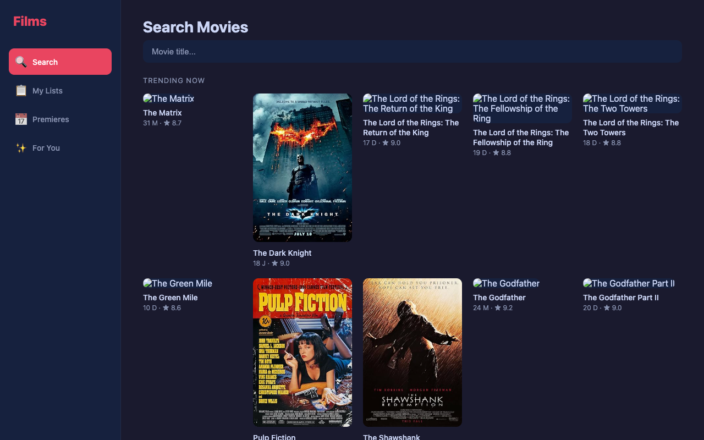
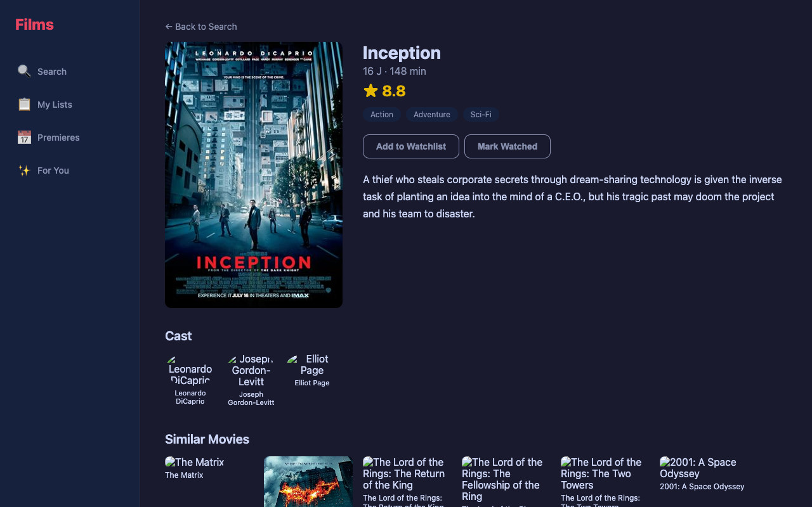
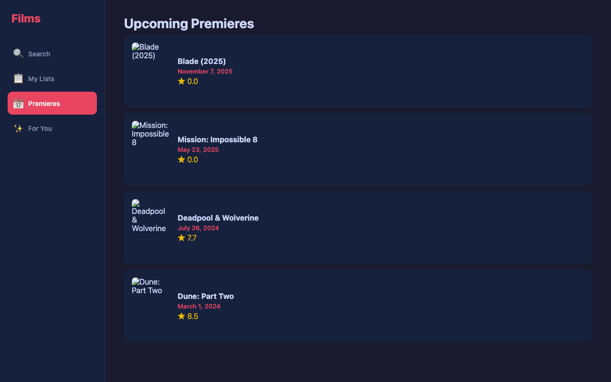

# Films — Movie Tracker & Planner

A web app for tracking movies you want to watch, with recommendations, ratings, and premiere calendar.





## Features

- **Search** 50+ classic and trending movies (fully local database)
- **Trending** — top-rated films sorted by IMDB rating
- **Three lists** — Watchlist, Watched, Favorites
- **Ratings** (1–10), notes, tags
- **Upcoming premieres** — Blade (2025), Mission Impossible 8, Deadpool & Wolverine, Dune: Part Two
- **Recommendations** — based on your watch history and genre preferences
- **Export** lists to CSV
- **Detailed movie pages** — description, cast, similar movies, genres
- **Dark theme** UI

## Tech Stack

- **Frontend**: React + Vite + TypeScript
- **Backend**: Node.js + Express + SQLite (sql.js)
- **Movie Data**: Local database (50+ films) + optional OMDb API

## Quick Start

```bash
# Backend
cd server && npm install && npm run dev

# Web client (in separate terminal)
cd web && npm install && npm run dev
```

Open **http://localhost:5173**

> The app works out of the box with a built-in local movie database. No API key required for basic functionality.

## Optional: OMDb API Key

For extended search (access to 500K+ movies), you can add an OMDb API key:

1. Go to **http://www.omdbapi.com/apikey.aspx**
2. Select **FREE** and enter your email
3. Receive key via email
4. Add to `server/.env`:
   ```
   OMDB_API_KEY=your_key_here
   ```
5. Restart the server

> Without the key, the app uses the local database of 50+ curated films — search, trending, recommendations, and premieres all work offline.

## Project Structure

```
Films/
├── server/              # Express API + SQLite + local movie DB
│   ├── src/
│   │   ├── db.ts        # SQLite database
│   │   ├── local-movies.ts  # 50+ curated movies with full metadata
│   │   ├── routes/
│   │   │   ├── movies.ts    # User lists CRUD
│   │   │   └── tmdb.ts     # Movie search & details
│   │   └── index.ts
│   └── .env.example
├── web/                 # React + Vite web client
│   └── src/
│       ├── pages/       # Search, Lists, Calendar, Recommendations, Movie Detail
│       └── services/    # API client
├── mobile/              # React Native + Expo (mobile app)
├── screenshots/         # App screenshots
└── README.md
```

## License

MIT
